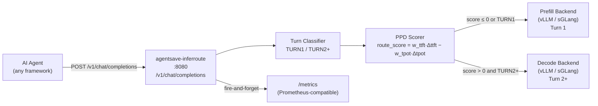

> **Part of [AgentSave](https://github.com/aks-builds/agentsave)** — the Python SDK that cuts AI agent token costs ~23%.
> This repo (`agentsave-inferroute`) is an **Enterprise-tier component** and requires a valid AgentSave Enterprise license key.
> Only deploy this if you operate a vLLM or sGLang inference cluster and hold an Enterprise license.

# agentsave-inferroute — PPD Inference Router

[](https://github.com/aks-builds/agentsave-inferroute/actions/workflows/ci.yml)
[](https://pypi.org/project/agentsave-inferroute/)
[](LICENSE)
[](https://www.python.org/)
[](https://github.com/aks-builds/agentsave)

> **agentsave-inferroute** is a FastAPI HTTP proxy sidecar that implements **PPD (append-Prefill-Decode) routing** for multi-turn LLM agent workloads. It classifies each request as a Turn 1 (prefill-heavy) or Turn 2+ (decode-heavy) conversation turn, then dispatches it to the backend optimized for that access pattern — targeting a ~68% TTFT reduction for Turn 2+ requests over a uniform-routing baseline.

---

## What is PPD Routing?

Modern LLM inference backends are tuned differently depending on the memory access pattern of the workload:

- **Turn 1 (prefill-heavy):** The model processes a long prompt (system prompt, tool schemas, initial user message) for the first time. The computation is dominated by the attention prefill pass over a large KV cache miss. A prefill-optimized backend (higher parallelism, larger chunked prefill batch) handles this efficiently.

- **Turn 2+ (append-heavy / decode-heavy):** The conversation history is already cached. The model appends only the new user message and generates the next assistant turn. The computation is dominated by autoregressive decoding over a warm KV cache. A decode-optimized backend (larger batch, speculative decoding, lower prefill overhead) handles this efficiently.

**PPD routing** separates these two request classes at the proxy layer and sends each to its optimal backend. The routing decision is made per request with zero latency overhead — the classifier is a single pass over the `messages[]` array.

The ~68% Turn 2+ TTFT reduction figure is an architectural projection derived from the PPD methodology in [arXiv:2603.13358](https://arxiv.org/abs/2603.13358) and the static improvement estimates embedded in the scorer (`ttft_improvement = 68.0 ms`, `tpot_degradation = 5.0 ms`). It has not been measured in a production deployment. Actual results will depend on your hardware, model, and traffic mix.

---

## Architecture



The proxy is transparent to the upstream agent — it accepts and returns standard OpenAI-compatible `/v1/chat/completions` JSON, including streaming (`"stream": true`).

**Classification rule:** if `messages[]` contains any entry with `"role": "assistant"`, the request is `TURN2_PLUS`; otherwise it is `TURN1`.

**Scoring rule:** `route_score = PPD_W_TTFT × ttft_improvement − PPD_W_TPOT × tpot_degradation`. With default weights (0.7 / 0.3) and static estimates (68.0 ms / 5.0 ms), score = 46.1, so all `TURN2_PLUS` requests are decode-routed.

---

## Quick Start

### Prerequisites

- Docker
- A running vLLM or sGLang cluster with two endpoints: one prefill-optimized, one decode-optimized
- A valid AgentSave Enterprise license key (set as `AGENTSAVE_TOKEN`)

### Run as a Docker sidecar

```bash
docker run -d \
  --name inferroute \
  -p 8080:8080 \
  -e BACKEND_URL=http://your-primary-backend:8000 \
  -e BACKEND_TYPE=vllm \
  -e AGENTSAVE_TOKEN=your-enterprise-license-key \
  ghcr.io/aks-builds/agentsave-inferroute:latest
```

Point your agent at `http://localhost:8080` instead of your inference backend directly. All `/v1/chat/completions` calls are automatically classified and routed.

### Verify it is running

```bash
curl http://localhost:8080/health
# {"status":"ok","backend_type":"vllm","version":"0.1.0"}
```

---

## Configuration

All configuration is via environment variables. No config file is required.

| Variable | Required | Default | Description |
|---|---|---|---|
| `BACKEND_URL` | No | `http://localhost:8000` | Base URL of the primary (fallback) backend. Used for Turn 1 requests or when decode routing is not configured separately. |
| `BACKEND_TYPE` | No | `vllm` | Inference backend adapter to use. Accepted values: `vllm`, `sglang`. |
| `AGENTSAVE_TOKEN` | Yes (Enterprise) | `""` | Your AgentSave Enterprise license key. Also used as the Bearer token when posting metrics to the AgentSave dashboard. |
| `AGENTSAVE_METRICS_URL` | No | *(disabled)* | Full URL to POST routing metrics to (e.g. `https://app.agentsave.ai/ingest`). Metrics are silently skipped if this is unset. |
| `PPD_W_TTFT` | No | `0.7` | Weight applied to TTFT improvement in the PPD scoring formula. Controls how strongly TTFT gains influence the route decision. |
| `PPD_W_TPOT` | No | `0.3` | Weight applied to TPOT degradation penalty in the PPD scoring formula. Must satisfy `PPD_W_TTFT + PPD_W_TPOT = 1.0` for standard operation. |

### Backend adapter signal details

| Backend | Decode routing signal |
|---|---|
| `vllm` | Adds HTTP header `X-Route-Type: decode` to the proxied request |
| `sglang` | Appends query parameter `router_prefix=decode` to the proxied request URL |

---

## API Endpoints

### `POST /v1/chat/completions`

Accepts any OpenAI-compatible chat completions request body. Classifies the turn, scores the routing decision, and proxies the request to the appropriate backend.

- Streaming (`"stream": true`) is fully supported via `StreamingResponse`.
- The request body and all headers are forwarded to the upstream backend unchanged, except for the routing signal injected by the adapter.
- Upstream timeout: 120 seconds.

**Example:**

```bash
curl -X POST http://localhost:8080/v1/chat/completions \
  -H "Content-Type: application/json" \
  -d '{
    "model": "meta-llama/Meta-Llama-3-8B-Instruct",
    "messages": [
      {"role": "user", "content": "Summarize the quarterly report."}
    ]
  }'
```

### `GET /health`

Liveness probe. Returns HTTP 200 with a JSON body including the configured backend type and router version.

```json
{"status": "ok", "backend_type": "vllm", "version": "0.1.0"}
```

### `GET /metrics`

Prometheus-compatible metrics endpoint. Reports routing decisions and backend activity for observability integration.

---

## Testing

The test suite covers the classifier, scorer, dispatcher, adapters, metrics emitter, and full end-to-end routing paths.

```bash
# Install development dependencies
pip install -e ".[dev]"

# Run the full suite
pytest tests/ -v
```

59 tests across 8 files, verified on Python 3.11, 3.12, and 3.13. CI runs the full suite on every push and pull request.

| Test file | Coverage area | Tests |
|---|---|---|
| `test_classifier.py` | Turn type detection from message history | 8 |
| `test_scoring.py` | PPDWeights validation + PPDScorer routing decisions | 11 |
| `test_adapters_vllm.py` | vLLM adapter request construction and decode signaling | 7 |
| `test_adapters_sglang.py` | sGLang adapter request construction and decode signaling | 9 |
| `test_dispatcher.py` | Dispatch routing logic (prefill vs. decode paths) | 4 |
| `test_metrics.py` | Metrics emission, auth header, error handling | 7 |
| `test_app.py` | FastAPI routes, health endpoint, HTTP layer | 7 |
| `test_integration.py` | End-to-end routing with live classifier and scorer | 6 |

---

## Contributing

This is a proprietary Enterprise component. External contributions are not accepted at this time. If you are an Enterprise customer and have found a bug or have a feature request, open an issue or contact your AgentSave account team.

For the open-source SDK, see [aks-builds/agentsave](https://github.com/aks-builds/agentsave).

---

## License

Proprietary. Use of this software requires a valid AgentSave Enterprise license. See [LICENSE](LICENSE) for terms.

---

*agentsave-inferroute v0.1.0 — part of the [AgentSave](https://github.com/aks-builds/agentsave) ecosystem*
